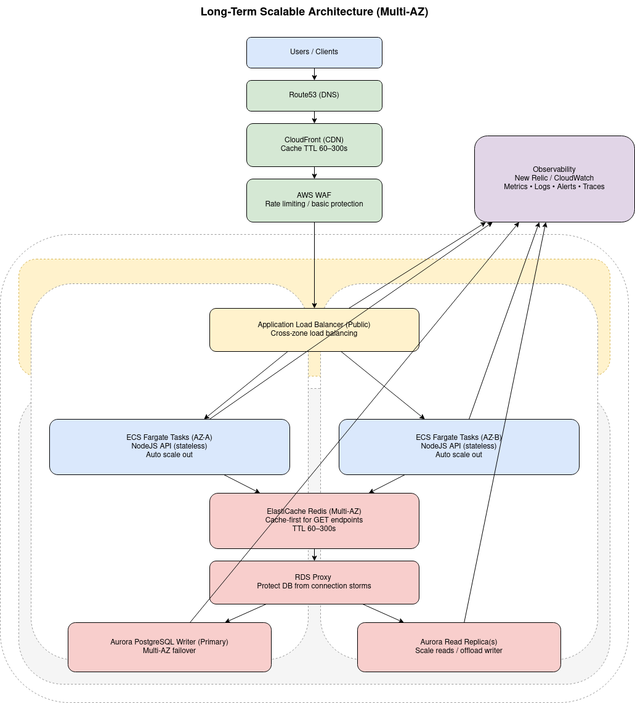

<br/>

<br/>
<br/>

# Tujuan Desain

Arsitektur ini dirancang untuk memenuhi kebutuhan:
- Mampu menangani hingga 40.000 request per menit (~667 req/sec)
- Traffic bersifat read-heavy (dominan GET request)
- Menghadapi lonjakan trafik (fluctuating load)
- High availability dan fault tolerant
- Tetap cost-efficient
- Siap digunakan di environment production
### Menggunakan Multi-AZ
```bash
Availability Zone A
Availability Zone B
ECS task tersebar di dua AZ
Aurora dengan Multi-AZ + Read Replica
```
```bash
Tujuan
- High Availability
Jika satu AZ mengalami gangguan, sistem tetap berjalan di AZ lainnya.
- Fault Tolerance
Tidak ada single point of failure pada layer compute maupun database.
- Zero Downtime Deployment
Rolling update dapat dilakukan tanpa mengganggu seluruh sistem.
```
### Edge Layer (Route53 → CloudFront → WAF → ALB)

```bash
Route53 (DNS)
- Resolusi domain
- Health check routing
```
```bash
CloudFront (CDN)
- Permintaan yang sama tidak selalu sampai ke backend
- Bisa mengurangi load backend hingga 70–80%
- Mengurangi latency untuk user global
```
```bash
AWS WAF
- Basic DDoS
- Abuse traffic
- Malicious request
```
```bash
AWS WAF
- TLS termination
- Health check container
- Cross-zone load balancing
- Distribute traffic ke ECS tasks
```
### Application Layer – ECS Fargate
```bash
- Tidak perlu mengelola server
- Stateless container design
- Mudah auto-scale
- Mendukung rolling deployment
```
### Cache Layer – Redis (ElastiCache)
```bash
- Redis digunakan sebagai cache-first layer
- TTL 60–300 detik
- Target cache hit ratio 70–80%
```
### Data Layer – Aurora PostgreSQL Multi-AZ
```bash
- Multi-AZ high availability
- Automatic failover
- Better performance dibanding RDS standard
- Mendukung read replica
```
### Observability Layer
```bash
- Monitoring CPU, memory, disk
- Monitoring request rate
- Error rate monitoring 
- Log aggregation
- Alerting
```
### Cost Efficiency Consideration
```bash
- CloudFront mengurangi compute cost
- Redis mengurangi DB load
- Auto-scaling hanya scale saat diperlukan
- Read replica bisa ditambah hanya jika perlu
```